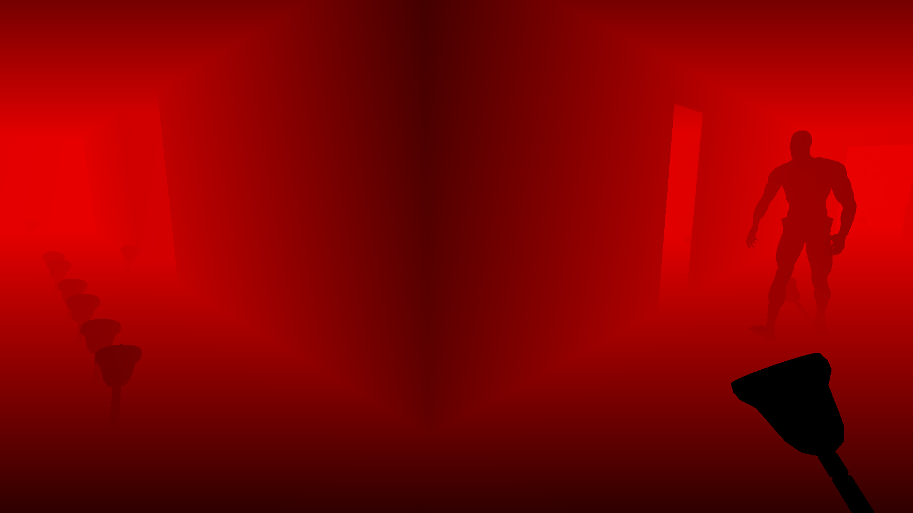
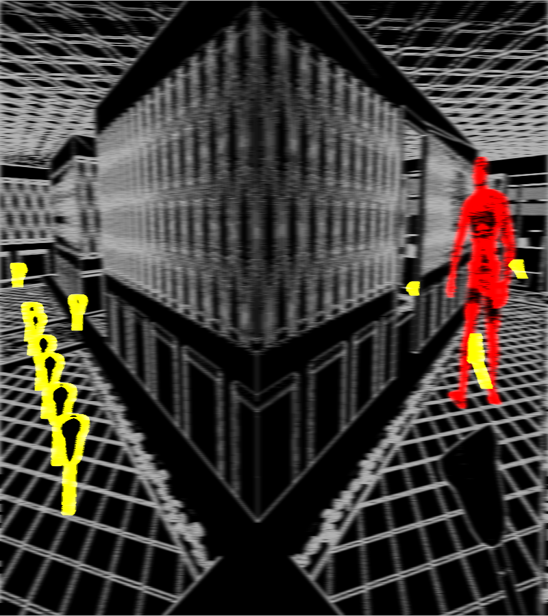
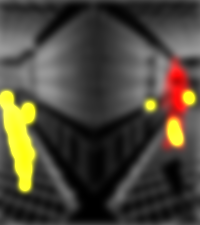
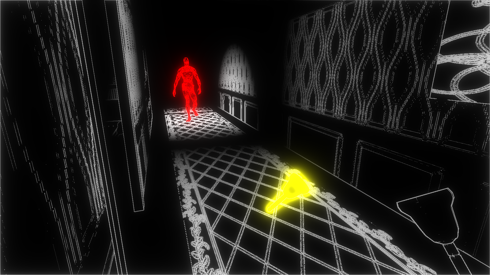
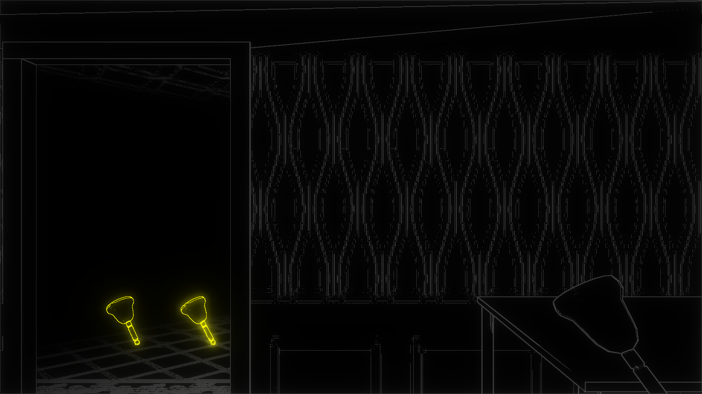
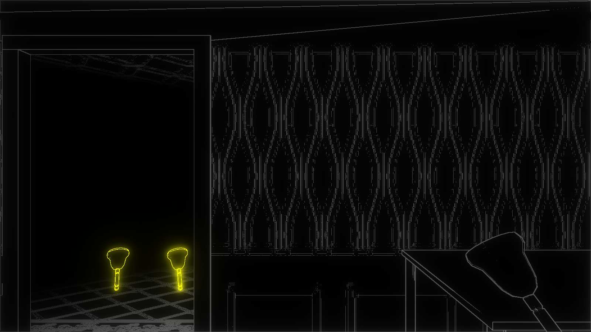

# **BlackNoise**
河原電子ビジネス専門学校  
  
ゲームクリエイター科2年　長山宏毅    
    
# **目次**  
1. [作品概要](#1-作品概要) 
  
2. [操作説明](#2-操作説明)  
  
3. [担当ソースコード](#3-担当ソースコード)  

4. [レンダリングエンジン](#4-レンダリングエンジン)
  
5. [輪郭線](#5-輪郭線)  
  
6. [川瀬式ブルーム](#6-川瀬式ブルーム)

7. [こだわり](#7-こだわり)  
  
  
  

# **1. 作品概要**
## ***BlackNoise***  
&emsp;一人称のホラーゲームです。  
&emsp;音を鳴らすことで周囲の状況を把握することができ、徘徊する敵から逃げながら、  
&emsp;落ちているアイテムを拾って一定時間内に多くのスコアを稼ぐゲームです。

## ・使用したゲームエンジン
&emsp;学校内製のエンジンを改造したものを使用

## ・使用したツール
&emsp;Visual Studio 2019  
&emsp;3ds Max 2022  
&emsp;Adobe Photoshop 2020  
&emsp;Git  

## ・使用した言語
&emsp;C++  
&emsp;HLSL  
## ・開発環境
&emsp;Windows10  
&emsp;DirectX12  

## ・制作人数
&emsp;5人

## ・開発期間
&emsp;2022年2月~2022年8月

 

追記 : 

U22プログラミングコンテスト事前審査通過し、上位32作品に選出

 

# **2. 操作説明**

- 左スティック : キャラクターの移動  
- 右スティック : カメラの移動  
- Bボタン : ベルを鳴らす

# **3. 担当ソースコード**
## 担当ソースコード  
   - BackGround.cpp  
   - BackGround.h
   - Bell.cpp
   - Bell.h
   - CollectItem.cpp
   - CollectItem.h
   - EdgeManagement.cpp
   - EdgeManagement.h
   - Enemy.cpp
   - Enemy.h
   - EnemyAttackState.cpp
   - EnemyAttackState.h
   - EnemyChaseState.cpp
   - EnemyChaseState.h
   - EnemyPath.cpp
   - EnemyPath.h
   - EnemyReturnToPathState.cpp
   - EnemyReturnToPathState.h
   - EnemyScreamState.cpp
   - EnemyScreamState.h
   - EnemySurveyState.cpp
   - EnemySurveyState.h
   - EnemyWalkState.cpp
   - EnemyWalkState.h
   - Fade.cpp
   - Fade.h
   - Game.cpp
   - Game.h
   - GameCamera.cpp
   - GameCamera.h
  - IEnemyState.h
   - Player.cpp
   - Player.h
   - Score.cpp
   - Score.h
   - TitleCamera.cpp
   - TitleCamera.h
   - TitleSprite.cpp
   - TitleSprite.h
   - TitleText.cpp
   - TItleText.h
   - Bloom.cpp
   - Bloom.h
   - EdgeControl.cpp
   - EdgeControl.h
   - LevelRender.cpp
   - LevelRender.h
   - MapChipRender.cpp
   - MapChipRender.h
   - ModelRender.cpp
   - ModelRender.h
   - RenderingEngine.cpp
   - RenderingEngine.h
   - SpriteRender.cpp
   - SpriteRender.h
   - bloom.fx
   - collectItem.fx
   - enemy.fx
   - normalModel.fx
   - renderToReservePassForModel.fx
  

# **4. レンダリングエンジン** 
1. 深度値、法線、ワールド座標を出力  

2. フォワードレンダリング

3. ブルーム

4. 2D描画

5. メインレンダリングターゲットをフレームバッファにコピー  

上記の手順によってレンダリングを行っています。

# **5. 輪郭線**
音が鳴った部分だけプレイヤーが認識できるということを表現するためにオブジェクトの**輪郭線**を表示させています。  
**輪郭線描画**には深度値と法線を使用しています。  
そのため、深度値を利用したモデルの端だけでなく、法線によってより細かく輪郭線を描画できるようになっています。  

  
  
**【深度値】**  

  
  
**【法線】**

  
  
**【2つのテクスチャをもとに輪郭線描画】**

# **6. 川瀬式ブルーム**
ブルームとして**川瀬式ブルーム**を実装しています。  
通常のシーンをレンダリングした後、輝度を抽出してダウンサンプリングとブラーを複数回行いテクスチャを作成します。  
そして、作成された複数のテクスチャを合成し、メインレンダリングターゲットに加算合成しています。  

  

**【輝度抽出】**  

  

↓

  

↓

  

**【複数回ブラーをかけながらダウンサンプリング】**
  
  

**【加算合成後】**
  

# **7. こだわり**
## **・音によって描画される輪郭線をよりよく魅せるために**
音で可視化される範囲をより奇麗にするために  
時間経過による影響率と音がなった位置からの距離による影響率を計算に使用しています。  
  

&emsp;**音が鳴った位置からの距離による影響率 × 時間経過による影響率**   
上記の計算式によってRGBの属性の1つの値を確定しており、それを全てに当てはめています。
  
**【距離による影響率】**  

  

 

このように、近ければ明るい色となっており、遠ければ暗い色となっています。  
輪郭線が描画されているピクセルと描画されていないピクセルの境界を分からなくすることによって見栄えが良くなっています。  

**【時間経過による影響率】**  
約1秒ごとの変化を記録しています。

  

  
  
  
      
  

このように徐々に明るくなり、基準値まで到達し次第、徐々に暗くなります。  

